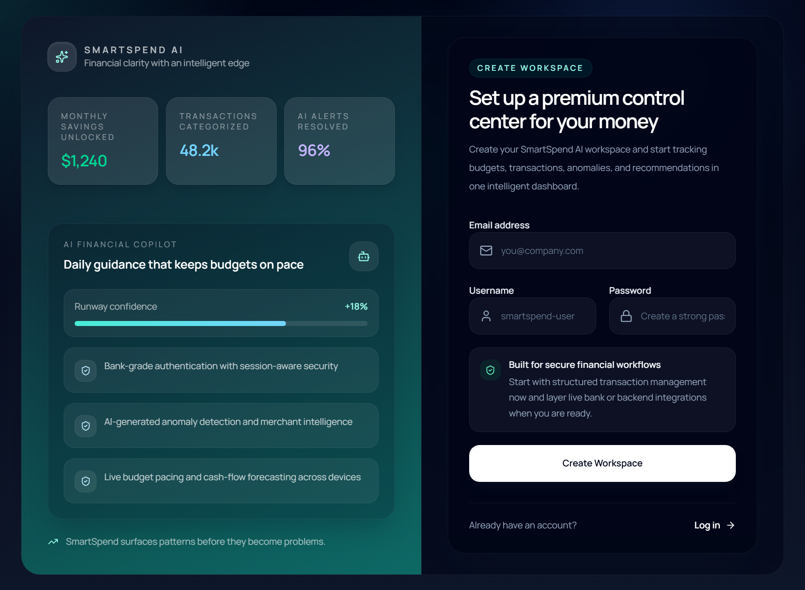
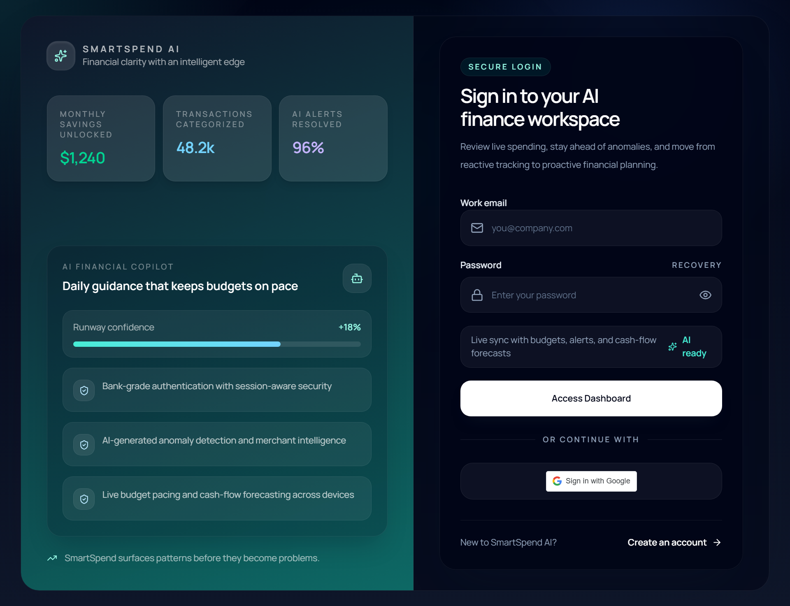
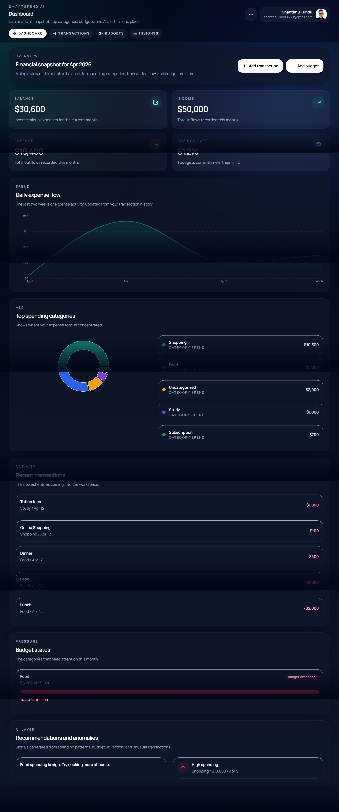
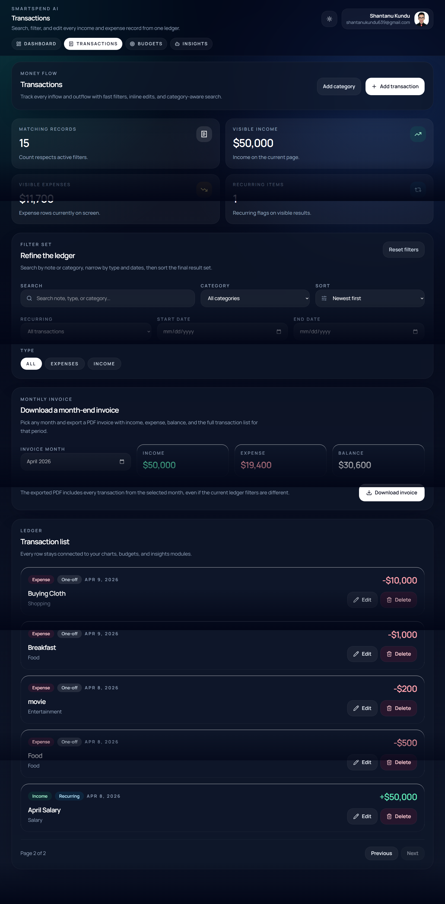
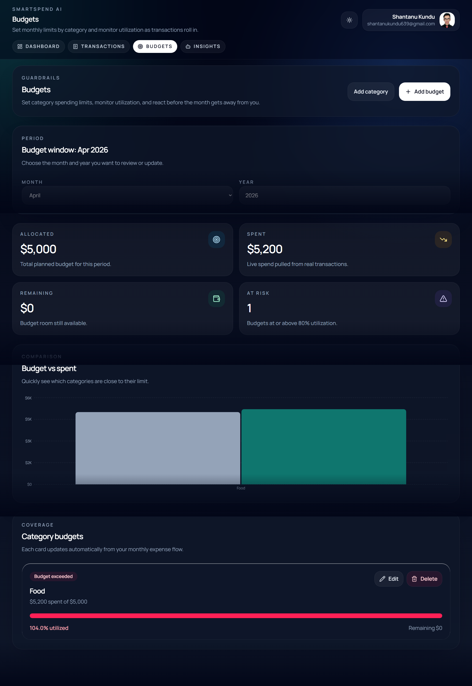
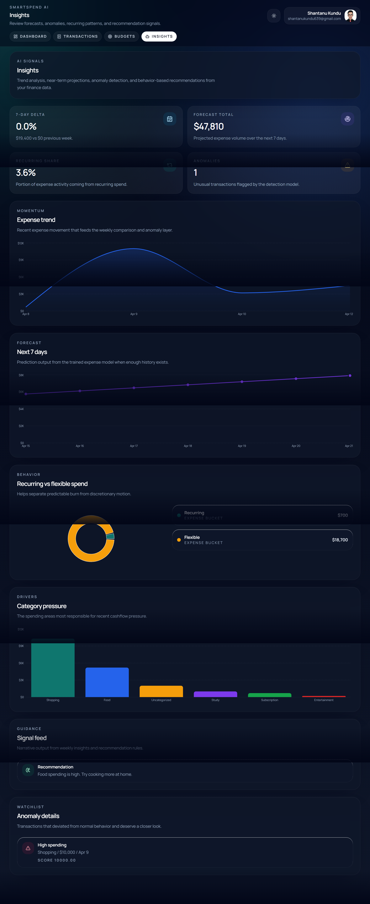
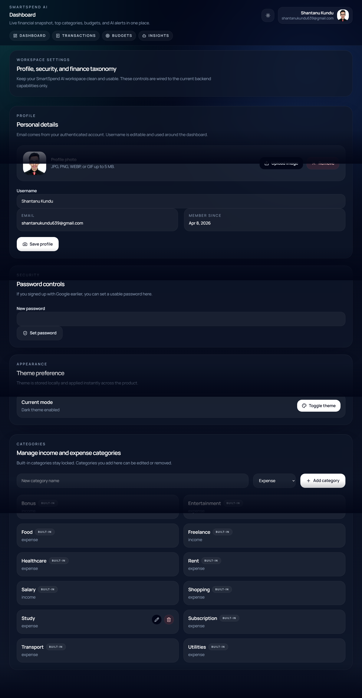

# SmartSpend-AI
SmartSpendAI is an AI-powered personal finance management web application built with Django and React. It helps users track expenses, analyze spending patterns, and make smarter financial decisions through intelligent insights and a modern dashboard.

---

## ✨ Key Features

### 📊 Smart Dashboard

* Real-time overview of income, expenses, and balance
* Interactive charts for financial visualization
* Clean and intuitive UI

### 💰 Transaction Management

* Add, edit, and delete transactions
* Categorize income and expenses
* Instant updates with smooth UX

### 🧠 AI-Powered Insights

* Analyze spending behavior
* Detect unusual transactions
* Personalized financial suggestions

### 🔐 Authentication & Security

* Secure user registration & login
* JWT-based authentication
* Protected routes and APIs

### 🎯 User Experience

* Fully responsive (mobile + desktop)
* Modern UI with Tailwind CSS
* Light/Dark mode support

---

## 🛠️ Tech Stack

### 🔹 Frontend

* React.js
* Tailwind CSS
* Axios
* React Router

### 🔹 Backend

* Django
* Django REST Framework
* PostgreSQL / SQLite
* JWT Authentication

---

## 📁 Project Structure

```
SmartSpendAI/
│
├── backend/
│   ├── accounts/
│   ├── analytics/
│   ├── config/
│   ├── core/
│   ├── ml/
│   └── transactions/
│
├── frontend/
│   ├── api/
│   ├── components/
│   ├── pages/
│   ├── layouts/
│   ├── store/
│   └── routes/
│
├── README.md
└── requirements.txt
```

---

## ⚙️ Installation & Setup

### 1️⃣ Clone Repository

```bash
git clone https://github.com/your-username/SmartSpendAI.git
cd SmartSpendAI
```

---

### 2️⃣ Backend Setup (Django)

```bash
cd backend

python -m venv venv
source venv/bin/activate   # Windows: venv\Scripts\activate

pip install -r requirements.txt

python manage.py migrate
python manage.py runserver
```

---

### 3️⃣ Frontend Setup (React)

```bash
cd frontend

npm install
npm run dev
```

---

## 🔐 Environment Variables

Create a `.env` file inside the backend directory:

```env
SECRET_KEY=your_secret_key
DEBUG=True
OPENAI_API_KEY=your_api_key
```

---

## 📸 Screenshots

### 🏠 Landing Page

<p align="center">
  
</p>

### Registration Page

<p align="center">
  
</p>

### Login Page

<p align="center">
  
</p>

### Dashboard Page

<p align="center">
  
</p>

### Transactions Page

<p align="center">
  
</p>

### Budgets Page

<p align="center">
  
</p>

### Insights Page

<p align="center">
  
</p>

### Settings Page

<p align="center">
  
</p>

---

## 🧪 Testing

* Test API endpoints using Postman
* Verify authentication flow
* Check transaction CRUD operations
* Validate AI insight responses

---

## 📌 Future Improvements

* Budget planning system
* Recurring expense tracking
* Export reports (PDF/CSV)
* Mobile app version
* Advanced AI predictions

---

## 🤝 Contributing

Contributions are welcome!

1. Fork the repository
2. Create a feature branch
3. Commit your changes
4. Open a pull request

---

## 📄 License

This project is licensed under the **MIT License**.

---

## 👨‍💻 Author

**Shantanu Kundu**
Full Stack Developer (Django + React)
Passionate about building AI-powered applications

---

## ⭐ Support

If you find this project useful, consider giving it a ⭐ on GitHub!
